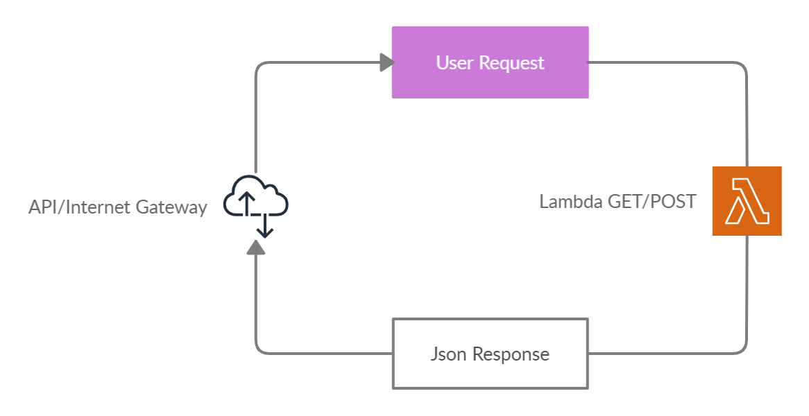
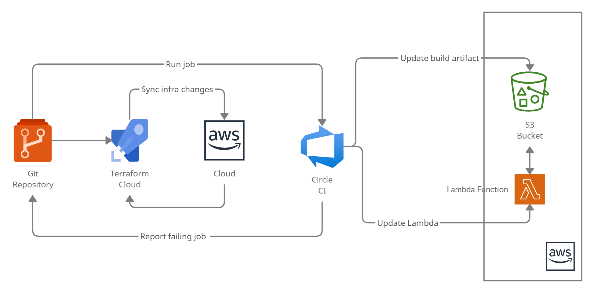

# terraform-lambda

[](https://circleci.com/gh/GerrardE/terraform-lambda/tree/main)

## Getting Started

This repo contains a simple web application that runs on AWS Lambda and prints the request header, method, and body. 

It is integrated with CircleCI CI/CD and Terraform for Infractructure as code (IaC) management using AWS as the cloud solutions provider.

## Architecture Diagram



## Required Technologies

This application makes use of the following technologies:

- [AWS API Gateway](https://console.aws.amazon.com/apigateway) for proxying lambda requests
- [AWS Lambda](https://console.aws.amazon.com/lambda) for serving Lambda functions
- [AWS S3](https://s3.console.aws.amazon.com/s3) for static file storage
- [Typescript](https://www.typescriptlang.org/) for Javascript type safety
- [Node](https://nodejs.org/) for creating the APIs
- [Circle CI](https://circleci.com/) for continuous integration and delivery
- [Terraform](https://www.terraform.io/) as an infrastructure as code tool.

## Installation

### 1. Installation Steps

These instructions assumes that you have a working installation of `git` and `nodejs`. See the instructions [git here](https://git-scm.com/book/en/v2/Getting-Started-Installing-Git) and [node here](https://nodejs.org/en/download/) to install them.

#### LOCAL

Provision the necessary services needed for running the application locally:

1. You will need AWS credentials to run this app:
      - Create an account on AWS for free [here](https://aws.amazon.com/free/)
      - Install the AWS CLI following the instructions [here](https://docs.aws.amazon.com/cli/latest/userguide/install-cliv2.html)
      - Create your AWS security credentials(`access key id` & `secret access key`) [here](https://console.aws.amazon.com/iam/home?#/security_credentials)
1. Follow the instructions [here](https://learn.hashicorp.com/tutorials/terraform/install-cli) to install `terraform` cli on your PC
1. Clone this repository to your PC and 
1. Run `yarn` or `npm install` in the root folder to install dependencies
1. Checkout into the cicd directory and run the following commands:
      - `terraform init` to initialize terraform locally
      - `terraform plan -var "provider_access_key=<awsaccesskeyidhere>" -var "provider_secret_key=<awssecretaccesskeyhere>"` to create a terraform plan
      - `terraform apply -var "provider_access_key=<awsaccesskeyidhere>" -var "provider_secret_key=<awssecretaccesskeyhere>"` and then when prompted to enter 
       a value, type in `yes` to create the necessary resources on aws.
1. The result of the previous step on the cli would be:

   ```
   artifact = <artifact object key>
   artifact_store = <artifact store id>
   function_1_name = <name of the first function>
   function_1_url = <The POST endpoint i.e function invocation url>
   function_2_name = <name of the second function>
   function_2_url = <The GET endpoint i.e function invocation url>
   ```
1. The endpoints from above can be hit using the following format:

   ```
   curl --header "Content-Type: application/json" --data '{"username":"xyz","password":"xyz"}' <function_2_url>
   ```

   Or using Postman.

#### CICD



1. Create a git repository [here](https://github.com/new) and push the source code to the repository using the instructions from the repository creation result
1. You will need AWS credentials to run this app:
      - Create an account on AWS for free [here](https://aws.amazon.com/free/)
      - Create your AWS security credentials(`access key id` & `secret access key`) [here](https://console.aws.amazon.com/iam/home?#/security_credentials)
1. Follow the instructions at the [Terraform Cloud docs](https://learn.hashicorp.com/collections/terraform/cloud-get-started?utm_source=terraform_io): 
      - Create the workspace: (In the `Advanced options` tab set the `Terraform Working Directory` to `cicd`)
      - link the git repository from the first step and setup aws credentials as variables like so:
         ```
         provider_access_key = `<awsaccesskeyidhere>`
         provider_secret_key = `<awssecretaccesskeyhere>`
         ```
1. Using these [instructions](https://learn.hashicorp.com/tutorials/terraform/cloud-workspace-configure?in=terraform/cloud-get-started):
      - Plan infrastructure changes
      - Apply planned changes: The outputs of from this step would be used to configure the CircleCi project.
1. Create a Circle CI project using the docs [here](https://circleci.com/docs/2.0/getting-started/).
   NB: skip the creation of a circle ci config file `.circleci/config.yml` since we already have one here.
   Add the following to the project environment variables: 
      - AWS_ACCESS_KEY_ID: `<awsaccesskeyidhere>`
      - AWS_ACCOUNT_ID: `<awsaccountidhere>`
      - AWS_DEFAULT_REGION: `us-east-1`
      - AWS_REGION: `us-east-1`
      - AWS_SECRET_ACCESS_KEY: `<awssecretaccesskeyhere>`
      - F1: `<function_1_name>`
      - F2: `<function_2_name>`
      - S3_BUCKET: `<artifact store>`
      - S3_BUCKET_KEY: `<artifact object key>`
1. Make changes in the code on the repository and watch the pipeline initialize and complete the `test_build_deploy` process.

## Tests

This project contains some tests. Follow these steps to run the tests locally.

1. Run `yarn test` in the root directory

## Cost Implication

- AWS Lambda free tier, 1 million always free requests monthly
- AWS API Gateway free tier, 1 million free api calls monthly for 1 year
- 10 always free AWS CloudWatch custom metrics, here we have just 3 custom metrics
- 5 GB AWS S3 bucket free for 1 year
- CircleCI provides 6000 build minutes/month for free always

In conclusion, it would not cost anything to get this simple app running for a whole year, as long as we remain within free tier limits.
For us to scale, we need to consider cost implications of moving to the next tier for each of the service considered.

## References

- [Terraform documentation](https://www.terraform.io/docs)
- [Deploy Serverless Applications with AWS Lambda and API Gateway](https://learn.hashicorp.com/tutorials/terraform/lambda-api-gateway)
- [AWS Lambda](https://docs.aws.amazon.com/lambda/?id=docs_gateway)
- [AWS API Gateway](https://docs.aws.amazon.com/apigateway/?id=docs_gateway)
